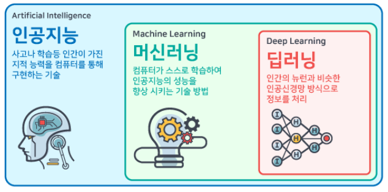
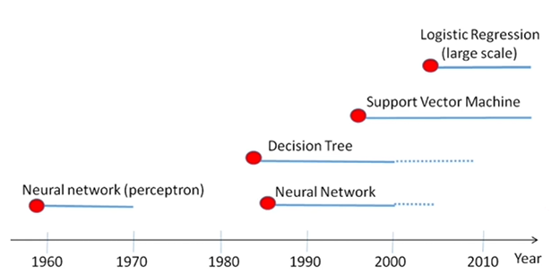

인공지능, 머신러닝, 딥러닝은 계층적 구조를 가지고 있다.




* 인공지능
  - 인간의 지능과 유사한 특성을 가진 컴퓨터
  
* 머신러닝
  - 기계적 기능을 수행하며 시간이 지남에 따라 기능이 점차 향상된다
  
* 딥러닝
  - 머신러닝의 하위 혹은 발전된 개념
  - 인공 신경망 구조를 통하여 인간이 결론을 내리는 방식과 유사하게 동작한다

`모델` 을 이용하여 동작한다

## Model


Neural network(perceptron) -> Neural network(mlp) -> Deep learning

## Problem

* Association Rule Mining
* <b>Supervised Learning</b>
  * Classification
  * Regression
* Unsupervised Learning
  * Clustering
  * <b>Feature Extraction</b>
  * <b>Dimensionality Reduction</b>
* Reinforcement Learning (ex. alphago)

### Association Rule Mining
장바구니 분석을 통해 고안되었다. 고객이 사는 아이템들이 서로 무슨 관계가 있는지 찾기 위한 분석 기법이다.

### Supervised Learning

Training Set(Labelled) -> Learning -> Estimated
```
1. 학습시킬 내용들이 준비되어있음
2. 그 내용들은 정답이 명시되어있음(labelled)
3. 학습
4. Training Set 의외의 데이터에 대해서 정답을 예측
```

### Unsupervised Learning

Training Set(Labelled or Unlabelled) -> Relation -> Result
```
1. 데이터가 주어짐
2. 정답을 활용하지 않기 때문에 labelled의 유무는 중요하지 않음
3. 패턴을 추출하거나 관계 구성
4. 명확한 정답은 없음
```

### Supervised vs Unsupervised

|지도 학습|비지도 학습|
|:---:|:---:|
|데이터로 모델을 학습하여 예측|데이터 내 패턴 찾기|
|예측적|기술적|
|분류, 회귀, 텍스트 마이닝|클러스터링, 연관 규칙 마이닝, 텍스트 마이닝|

ex)
```
오리 사진을 학습시킴
1. Supervised : 오리와 오리가 아닌 것을 분류
2. Unsupervised : 다리 개수, 귀의 유무, 날개 모양 등으로 군집화
```

### Reinforcement Learning
* Unsupervised Learning 의 일종
* 정해진 데이터에 의해 학습되어지는 것은 아님
* 보상/벌점의 개념을 모델링
* 모델의 행위에 맞게 일어나는 경험을 학습
