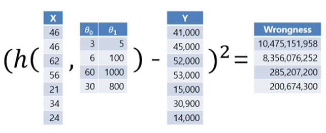

## 딥러닝의 구조

* Supervised Model

ex)
||면적|가격|
|:-:|:-:|:-:|
|1|12|10000|
|2|15|20000|
|3|20|33000|
|4|25|41000|
|5|31|50000|

```
x = [면적] / y = [가격] 인 Labelled 트레이닝셋
x = ? 일때의 y 를 구하는 모델을 구현할 수 있음
```
x의 반복적인 대입을 통해 기존 학습셋의 y와 예측된 결과 y'의 차이를 좁히는 것이 딥러닝의 구조

## 비용 함수

J : cost function


임의의 x(input)를 통해 h(x)에서 출력되는 y'값과 y의 (-)연산을 통해 차이를 측정
제곱은 결과값을 항상 양수로 만들기위해 필요한 연산이다



## 경사하강법
