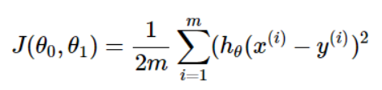

## 딥러닝의 구조

* Supervised Model

ex)
||면적|가격|
|:-:|:-:|:-:|
|1|12|10000|
|2|15|20000|
|3|20|33000|
|4|25|41000|
|5|31|50000|

```
x = [면적] / y = [가격] 인 Labelled 트레이닝셋
x = ? 일때의 y 를 구하는 모델을 구현할 수 있음
```
x의 반복적인 대입을 통해 기존 학습셋의 y와 예측된 결과 y'의 차이를 좁히는 것이 딥러닝의 구조

## 비용 함수



J : cost function

임의의 x(input)를 통해 h(x)에서 출력되는 y'값과 y의 (-)연산을 통해 차이를 측정

```
제곱은 결과값을 항상 양수로 만들기위해 필요한 연산이다
값이 너무 커진다면 제곱근을 하여 사용한다
```


## 경사하강법

무한한 x를 넣을수는 없으므로 비용함수의 최솟값을 찾아야한다


비용함수는 오차가 벌어질수록 제곱으로 인해 급증하게 되므로 2차함수 형태가 된다


```
알파값은 Learning rate 라고 부른다.
이 값이 너무 크다면 발산해버리고 너무 작다면 최적점을 찾는데에 시간이 과도하게 걸린다.
```

비용함수를 j에 대해 편미분한 것은 j위치에서의 접선의 기울기와 같다.
이 값을 초기 j값에서 빼면된다. 반복시행하여 최적의 값을 찾는다.
