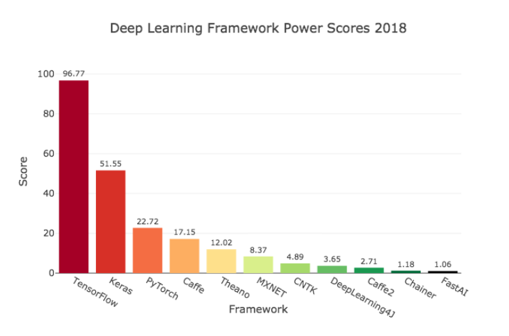

## 딥러닝 라이브러리
```
Keras
TensorFlow
Caffe
PyTorch
...
```

각 라이브러리 별 장단점이 존재하고 distinct 별 선호하는 라이브러리가 다름



* TensorFlow : 2.0이 나오면서 어려운 문법을 보완하였지만 속도가 느린편이다.
* Keras : high-level api로 TensorFlow 위에서 동작한다. 문법이 쉬움.
* PyTorch : 간결하고 빠르다. 위의 두 라이브러리의 장점들을 가졌다. 연구직종에서 선호하는 라이브러리이다.

### Pre-requisite

* 이산수학, 미분학, 선형대수

### To do

* 모델 반복적 구현
* 많은 모델 구현
* 문제 해결
